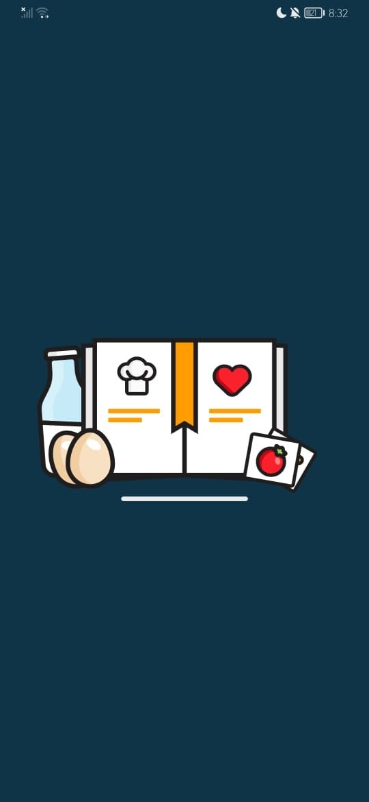
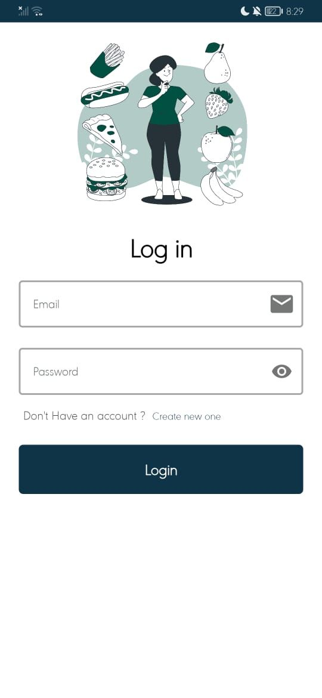
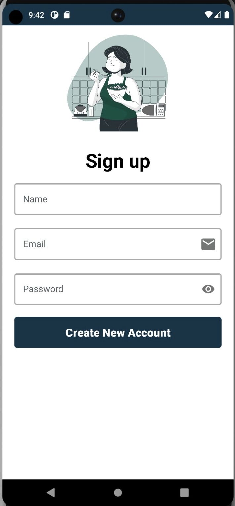
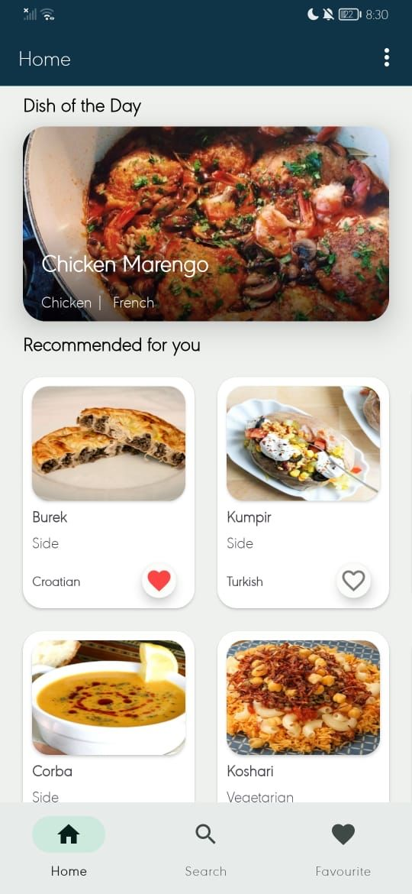
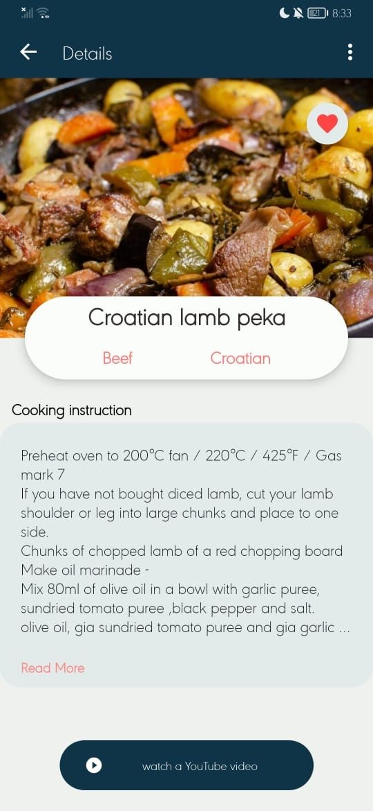
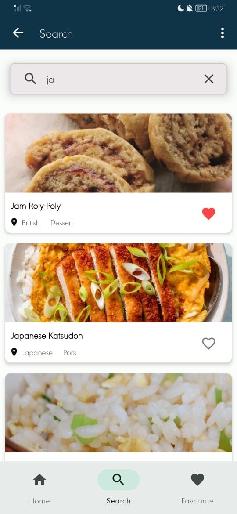
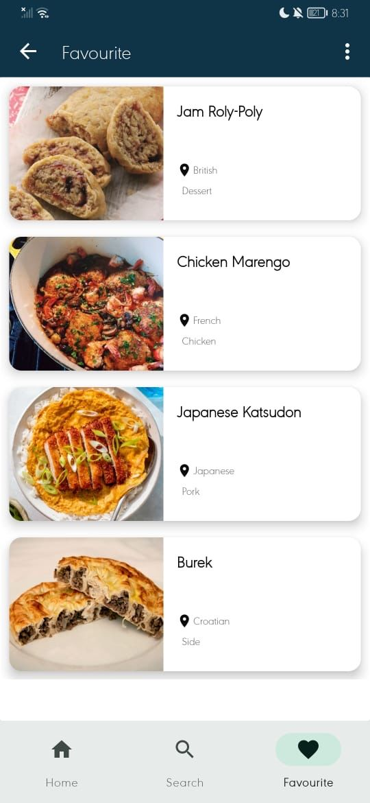

# 🍳 Bon Appétit- Android Recipe App

**Welcome to the Bon Appétit Android app repository!** This app is designed for recipe enthusiasts from all around the globe. With a focus on providing detailed recipes, our app aims to make it convenient for users to prepare and savor their favorite dishes. We invite you to explore the features and ease of our application to enhance your cooking experience.

## 🌟 Features

- Explore a wide range of recipes from different parts of the world.
- Detailed recipe information including ingredients, instructions, and cooking tips.
- User-friendly interface with **Material Design principles**.
- Utilizes modern Android components and libraries, including:
- Coroutines for asynchronous programming.
- Activity and Fragment for UI components.
- Intent for navigating between screens.
- RecyclerView for displaying lists of recipes.
- Navigation Component for app navigation.
- Room Database for local storage of recipes.
- Glide Library for efficient image loading.
- Lottie Library for engaging animations.
- Shimmer Library for loading placeholders.
- Retrofit Library for API communication.
- ViewModel & LiveData for maintaining UI state.
- Follows the Repository Pattern in the MVVM architecture.
- Dependency Injection for managing app components.

## 📚 Resources

- API: https://www.themealdb.com/api.php
- Programming Language: Kotlin

---

Happy cooking and exploring the diverse world of recipes with Recipe World! If you have any questions or feedback, please don't hesitate to reach out 🍽️🌍

## 📸 Screenshots

Click to expand

### Splash Screen

### Login Screen

### signup Screen

### Home Screen

### Recipe Details Screen

### search Screen

### favourite Screen

